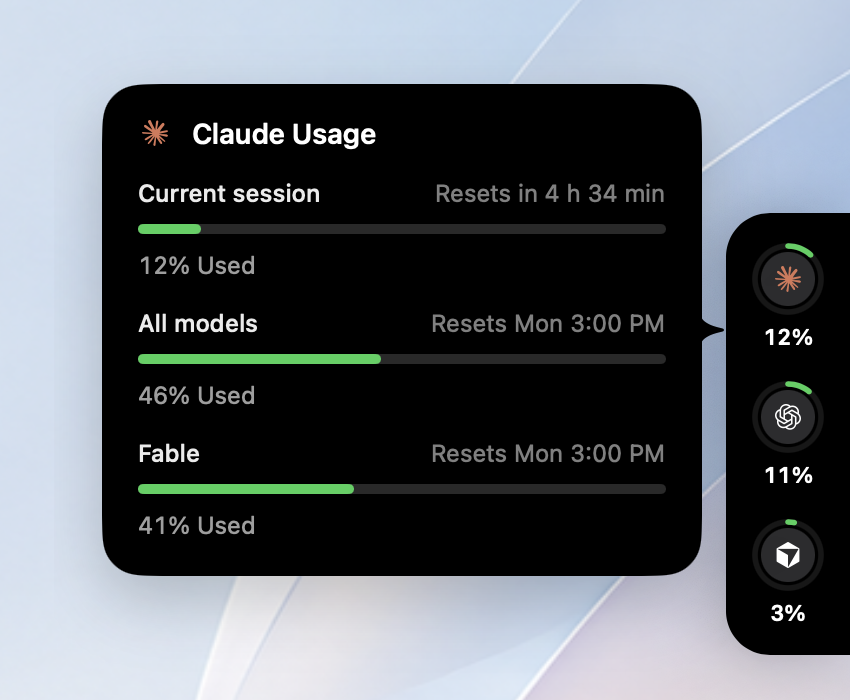

# Mana

[](https://github.com/TinyFrontier/mana_bar/releases)
[](#requirements)
[](LICENSE)

**How much of your Claude, ChatGPT and Cursor limits is left — without opening a browser.**

Mana is a native macOS menu-bar app. Its panel lives hidden behind the edge of
your screen and slides out when the cursor touches that edge, the way the
Grammarly widget does. No Dock icon, no window in your way.

It reuses the logins those tools already have on your Mac, so there is no token
to paste and no account to create.

<p align="center">
  
</p>

## Install

```bash
brew install --cask TinyFrontier/tap/mana
```

Upgrade with `brew upgrade --cask mana`, remove with `brew uninstall --cask mana`
(add `--zap` to also drop settings and the cached usage).

You can also grab the `.dmg` from [Releases](https://github.com/TinyFrontier/mana_bar/releases).
Builds are code-signed but **not notarized yet** — that needs a paid Apple
Developer Program membership — so macOS quarantines a manual download and
refuses to open it. The Homebrew cask clears that for you. If you install the
`.dmg` by hand, approve the app under System Settings → Privacy & Security, or:

```bash
xattr -d com.apple.quarantine /Applications/Mana.app
```

## What it shows

- **Claude** — the rolling session window, the weekly all-models window and the
  weekly per-model one, each with the time it resets.
- **ChatGPT** — the usage windows the Codex CLI login exposes.
- **Cursor** — included usage for the current billing period, with the date it
  renews.
- A ring per service, colored by how close you are to the limit, plus a detail
  card on hover.
- Notifications when a window crosses 80% or 95%, and when a limit resets.
- Settings for which services to show and in what order, which screen edge the
  panel hides behind and how far down it sits, how often usage refreshes, and
  whether Mana starts at login.

## Where the numbers come from

Mana reads the OAuth tokens that Claude Code, Claude Desktop and the Codex CLI
already store on your Mac — the same logins those tools use — and calls each
vendor's own usage endpoint with them:

| Service | Source of the login |
|---------|--------------------|
| Claude | Claude Code's Keychain item, `~/.claude/.credentials.json`, or Claude Desktop's encrypted cache |
| ChatGPT | `~/.codex/auth.json`, or the `Codex Auth` Keychain item |
| Cursor | Cursor's own `state.vscdb`, or its `cursor-access-token` Keychain item |

What that means in practice:

- **No token to paste, no Mana account.** If the CLI works, Mana works.
- **Nothing leaves your machine** except the requests to Anthropic and OpenAI
  themselves. No telemetry, no analytics, no crash reporting.
- **Mana keeps no copy of your credentials.** Tokens are read at the moment of
  a request and never written to its own storage; tokens and response bodies
  are never logged.
- **Read-only where it matters.** Mana never rewrites a CLI's Keychain item —
  doing so breaks that CLI's own access to its credentials — and it never
  touches Claude Desktop's refresh token, so your Desktop session survives.

macOS will ask once for permission to read Claude Code's Keychain item. Choose
**Always Allow** and background refreshes stay silent.

## Requirements

- macOS 13 (Ventura) or later
- At least one signed-in source: [Claude Code CLI](https://claude.com/claude-code),
  [Codex CLI](https://developers.openai.com/codex/cli) or
  [Cursor](https://cursor.com) — Mana shows a service only when it finds that
  service's login

## Not there yet

Notarization (needs a Developer ID certificate), an explicit monitor picker for
multi-display setups, and richer per-Space behavior. Usage history and spend
tracking are out of scope for now.

## Development

```bash
brew install xcodegen
xcodegen generate
xcodebuild -project Mana.xcodeproj -scheme Mana -configuration Debug build
xcodebuild -project Mana.xcodeproj -scheme Mana -configuration Debug test -destination 'platform=macOS'
```

The `.xcodeproj` is generated from `project.yml` and is not checked in — run
`xcodegen generate` after cloning and after any `project.yml` change.

Packaging, signing, notarization, the release flow and the Accessibility-grant
quirk that bites during development are documented in
[DEVELOPMENT.md](DEVELOPMENT.md).

## Credits

The provider layer — how to find each CLI's login, which usage endpoints to
call, and how to refresh a token without invalidating the CLI's own session —
follows [openusage](https://github.com/robinebers/openusage) (MIT). See
[THIRD-PARTY-NOTICES.md](THIRD-PARTY-NOTICES.md).

## License

[MIT](LICENSE).
